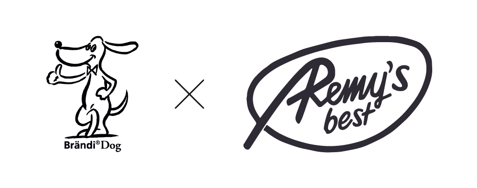

<h1 align="center">
  <br>
   
  <br>
  Remy's Best Server
  <br>
</h1>
<p align="center">
  <a href="https://github.com/sopra-fs21-group-06/remys-best-server/actions">
    
  </a>
  <a href="https://heroku-badge.herokuapp.com/?app=remys-best-server"></a>
  <a href="https://sonarcloud.io/dashboard?id=sopra-fs21-group-06_remys-best-server">
      
  </a>
  <a href="https://sonarcloud.io/dashboard?id=sopra-fs21-group-06_remys-best-server">
        
    </a>
</p>

## Introduction

Brändi Dog is a fun card/board game created by [Stiftung Brändi](https://www.braendi.ch/). This repository is the back-end part of an online implementation for this board game.

## Technologies

The server is written in Java using the Spring Boot framework. JPA is used for persistence and deployment is handled by Heroku.

To establish a connection between the front- and backend REST is used. Upon logging in a websocket connection gets established.

## High-level Components

The [WSGameController](src/main/java/ch/uzh/ifi/hase/soprafs21/controller/WSGameController.java) receives all game-related packages and passes them to the [GameService](src/main/java/ch/uzh/ifi/hase/soprafs21/service/GameService.java). The GameService then reads the packages and assigns the tasks to the Game and Round.

The [Game](src/main/java/ch/uzh/ifi/hase/soprafs21/objects/Game.java) class handles the overall state of the game (game starts, round starts, round or game ends etc). </br> The [GameEngine](src/main/java/ch/uzh/ifi/hase/soprafs21/objects/GameEngine.java) class handles the entire gamecreation, management and initialization. Which means it serves as a central ledger while also being the most highlevel service class. The GameEngine belongs to the biggest classes of the back-end.


When starting the server the [Application](src/main/java/ch/uzh/ifi/hase/soprafs21/Application.java) class gets executed.

## Launch & Deployment

### Build

```bash
./gradlew build
```

### Run

```bash
./gradlew bootRun
```

### Test

```bash
./gradlew test
```

## Roadmap

1. Implement the game logic
2. Minor Bug fixes
3. Mobile Version?

## Authors and Acknowledgements

### Members of the SoPra-group 06 2021:

[Andrina Vincenz](https://github.com/AndrinaVincenz), [Edouard Schmitz](https://github.com/edischmitz), [Pascal Emmenegger](https://github.com/pemmenegger), [Siddhant Sahu](https://github.com/iamsiddhantsahu), [Sandro Volontè](https://github.com/SandroVolonte)

### Acknowledgements

First of all we want to thank Stiftung Brändi for creating such an amazing game. We all had a fun time implementing the game, and also learned a lot.
Further we would like to thank our tutor Remy Egloff, who always provided useful advice to get cleaner code and more user-friendliness. We are also very grateful for our friends and families for testing our game extensively and also providing improvements in terms of user-friendlyness.

## License
Apache License 2.0